# 🌙 KuruBot

**KuruBot** is an intelligent RAG (Retrieval-Augmented Generation) chatbot built with the [T3 Stack](https://create.t3.gg/) that transforms your documents into conversational AI experiences. Upload your PDFs, ask questions, and get accurate, context-aware responses powered by cutting-edge AI technology.


## ✨ Features

### 🤖 **Intelligent Chat Interface**

- Real-time conversations with your documents
- Context-aware responses using RAG technology
- Chat history and conversation management
- Source citations for every response
- Beautiful moon-themed UI with modern design

### 📚 **Document Processing**

- **Support for multiple formats**: PDF, DOCX, TXT, CSV, Markdown
- **Advanced text extraction**: PDF parsing with content preservation
- **Smart chunking**: Optimal text segmentation for better retrieval
- **Vector embeddings**: OpenAI text-embedding-3-large for semantic search
- **File size limit**: Up to 20MB per document

### 🔍 **Advanced Retrieval System**

- **Vector database**: Qdrant for high-performance similarity search
- **Semantic search**: Find relevant content by meaning, not just keywords
- **Configurable scoring**: Adjustable similarity thresholds
- **Multi-document support**: Search across your entire knowledge base
- **Real-time indexing**: Documents are immediately searchable after processing

### 🛡️ **Security & Authentication**

- **Discord OAuth**: Secure authentication via Discord
- **User isolation**: Each user's documents are completely separate
- **Session management**: Secure session handling with NextAuth.js
- **Enterprise-grade storage**: MinIO S3-compatible object storage

### ⚡ **Performance & Scalability**

- **Fast processing**: Efficient document chunking and embedding
- **Real-time responses**: Optimized query processing
- **Scalable architecture**: Built for production workloads
- **Database optimization**: PostgreSQL with proper indexing

## 🏗️ Architecture

KuruBot uses a modern, scalable architecture:

```mermaid
graph TB
    subgraph "Frontend Layer"
        UI[🌙 Next.js App<br/>React UI<br/>Tailwind CSS]
    end

    subgraph "API Layer"
        API[⚡ tRPC API<br/>Type-safe Endpoints<br/>Server Actions]
    end

    subgraph "AI Services"
        OpenAI[🤖 OpenAI<br/>Text Embeddings<br/>text-embedding-3-large]
        Anthropic[🧠 Anthropic<br/>Claude 3.5 Sonnet<br/>Chat Responses]
    end

    subgraph "Authentication"
        Auth[🔐 NextAuth.js<br/>Discord OAuth<br/>Session Management]
    end

    subgraph "Data Layer"
        DB[(🗄️ PostgreSQL<br/>Prisma ORM<br/>User Data & Chats)]
        Vector[(🔍 Qdrant<br/>Vector Database<br/>Document Embeddings)]
        Storage[📁 MinIO<br/>S3-Compatible<br/>Document Storage]
    end

    UI --> API
    API --> Auth
    API --> OpenAI
    API --> Anthropic
    API --> DB
    API --> Vector
    API --> Storage

    OpenAI -.-> Vector

    classDef frontend fill:#3b82f6,stroke:#1e40af,stroke-width:2px,color:#fff
    classDef api fill:#8b5cf6,stroke:#6d28d9,stroke-width:2px,color:#fff
    classDef ai fill:#f59e0b,stroke:#d97706,stroke-width:2px,color:#fff
    classDef auth fill:#10b981,stroke:#047857,stroke-width:2px,color:#fff
    classDef data fill:#ef4444,stroke:#dc2626,stroke-width:2px,color:#fff

    class UI frontend
    class API api
    class OpenAI,Anthropic ai
    class Auth auth
    class DB,Vector,Storage data
```



## 🚀 Quick Start

### Prerequisites

- Node.js 18+ and pnpm
- PostgreSQL database
- Qdrant vector database
- MinIO or S3-compatible storage
- Discord OAuth app
- OpenAI API key
- Anthropic API key

### Installation

1. **Clone the repository**

   ```bash
   git clone <your-repo-url>
   cd kurubot
   ```

2. **Install dependencies**

   ```bash
   pnpm install
   ```

3. **Set up environment variables**

   ```bash
   cp .env.example .env
   ```

   Configure the following in your `.env` file:

   ```env
   # Database
   DATABASE_URL="postgresql://..."

   # Authentication
   AUTH_SECRET="your-secret-key"
   AUTH_DISCORD_ID="your-discord-client-id"
   AUTH_DISCORD_SECRET="your-discord-client-secret"

   # Storage (MinIO/S3)
   MINIO_ENDPOINT="localhost:9000"
   MINIO_ACCESS_KEY="your-access-key"
   MINIO_SECRET_KEY="your-secret-key"
   MINIO_BUCKET="kurubot-documents"

   # Vector Database (Qdrant)
   QDRANT_URL="http://localhost:6333"
   QDRANT_COLLECTION="documents"

   # AI Services
   OPENAI_API_KEY="sk-..."
   OPENAI_EMBEDDING_MODEL="text-embedding-3-large"
   ANTHROPIC_API_KEY="sk-ant-..."
   ANTHROPIC_CLAUDE_MODEL="claude-3-5-sonnet-20241022"
   ```

4. **Set up the database**

   ```bash
   pnpm db:push
   ```

5. **Start the development server**

   ```bash
   pnpm dev
   ```

6. **Visit the application**
   Open [http://localhost:3000](http://localhost:3000) in your browser

## 🛠️ Development

### Available Scripts

- `pnpm dev` - Start development server with Turbo
- `pnpm build` - Build for production
- `pnpm start` - Start production server
- `pnpm db:push` - Push database schema
- `pnpm db:studio` - Open Prisma Studio
- `pnpm lint` - Run ESLint
- `pnpm typecheck` - Run TypeScript checks
- `pnpm shadcn:add` - Add shadcn/ui components

### Tech Stack

- **Framework**: Next.js 15 with App Router
- **Language**: TypeScript
- **UI**: React 19, Tailwind CSS, shadcn/ui
- **API**: tRPC for type-safe APIs
- **Database**: PostgreSQL with Prisma ORM
- **Authentication**: NextAuth.js with Discord
- **Storage**: MinIO (S3-compatible)
- **Vector DB**: Qdrant
- **AI**: OpenAI (embeddings), Anthropic Claude (chat)
- **Deployment**: Vercel-ready

## 📖 Usage Guide

### 1. **Upload Documents**

- Navigate to the Admin Panel
- Drag and drop your PDF, DOCX, or text files
- Wait for processing and indexing to complete

### 2. **Start Chatting**

- Go to the Chat interface
- Ask questions about your uploaded documents
- Get intelligent responses with source citations

### 3. **Manage Conversations**

- View all your chat history in the sidebar
- Create new conversations
- Delete old chats when needed

### 4. **Monitor System**

- Check document processing status
- View system statistics
- Debug vector database connections

## 🔧 Configuration

### Document Processing

- **Chunk Size**: 1000 characters
- **Overlap**: 200 characters
- **Embedding Model**: OpenAI text-embedding-3-large (3072 dimensions)
- **Max File Size**: 20MB per file

### RAG Settings

- **Default Sources**: 5 per query
- **Score Threshold**: 0.3 (configurable)
- **Context Window**: Up to 10 recent messages
- **LLM Model**: Claude 3.5 Sonnet

### Vector Database

- **Distance Metric**: Cosine similarity
- **Index Type**: HNSW
- **Collection**: Automatically created on first use

## 🐳 Deployment

### Using Docker

1. **Build the application**

   ```bash
   docker build -t kurubot .
   ```

2. **Run with docker-compose**

   ```yaml
   version: "3.8"
   services:
     kurubot:
       image: kurubot
       ports:
         - "3000:3000"
       environment:
         - DATABASE_URL=postgresql://...
         - QDRANT_URL=http://qdrant:6333
         # ... other env vars

     postgres:
       image: postgres:15
       # ... postgres config

     qdrant:
       image: qdrant/qdrant
       # ... qdrant config

     minio:
       image: minio/minio
       # ... minio config
   ```

### Using Vercel

1. **Deploy to Vercel**

   ```bash
   vercel deploy
   ```

2. **Configure environment variables** in the Vercel dashboard

3. **Set up external services** (PostgreSQL, Qdrant, MinIO)

## 🤝 Contributing

We welcome contributions! Please see our [Contributing Guide](CONTRIBUTING.md) for details.

### Development Setup

1. Fork the repository
2. Create a feature branch
3. Make your changes
4. Add tests if applicable
5. Submit a pull request

## 📄 License

This project is licensed under the MIT License - see the [LICENSE](LICENSE) file for details.

## 🙏 Acknowledgments

- Built with the amazing [T3 Stack](https://create.t3.gg/)
- UI components from [shadcn/ui](https://ui.shadcn.com/)
- Icons from [Lucide React](https://lucide.dev/)
- AI powered by [OpenAI](https://openai.com/) and [Anthropic](https://anthropic.com/)

## 📞 Support

- 📧 **Email**: [your-email@domain.com]
- 💬 **Discord**: [Your Discord Server]
- 🐛 **Issues**: [GitHub Issues](https://github.com/your-username/kurubot/issues)

---

<div align="center">
  <p>Made with ❤️ and powered by 🌙</p>
  <p><strong>KuruBot - Your Intelligent Document Assistant</strong></p>
</div>
